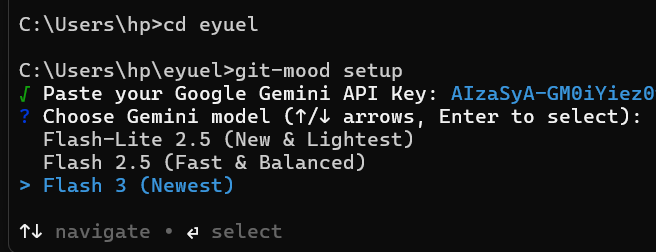
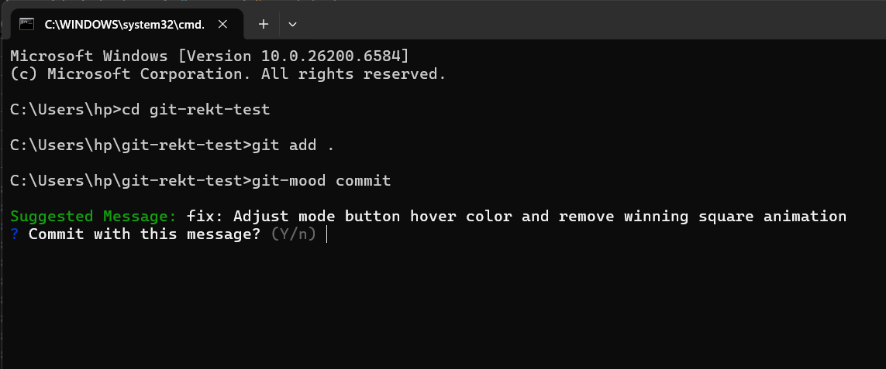
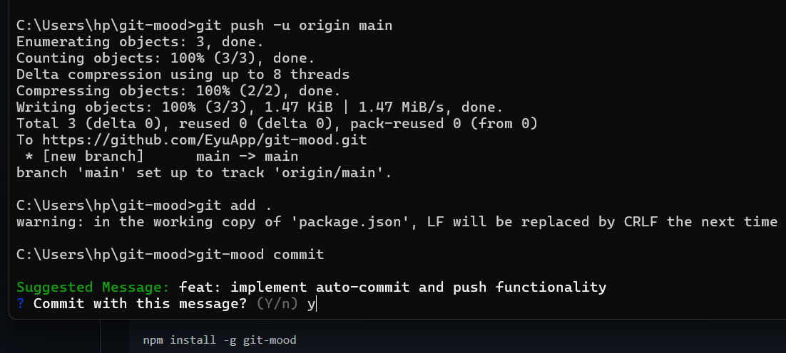

# git-mood

<p align="center">
  
</p>

<p align="center">
  <b>The AI-powered Git assistant that understands your code's "mood".</b><br>
  <i>Generate conventional commits, perform deep code reviews, and push to GitHub—all with Google Gemini.</i>
</p>

<p align="center">
  
  
  
</p>

---

## 🚀 Key Features

### 🧠 Smart Commits
Analyzes staged diffs and writes perfect **Conventional Commits**.

<p align="center">
  
</p>

---

### 🔍 Deep Review
Senior-level feedback on bugs, security, and clean code patterns.

<p align="center">
  
</p>

---

### ⚡ Flash Models
Powered by the latest **Gemini Flash** models (Lite 2.5, 2.5, and 3).

<p align="center">
  
</p>

---

## 📦 Installation

```bash
# Install globally
npm install -g git-mood

# Or run instantly with npx
npx git-mood commit
```

---

## 🛠️ Getting Started

### 1. Setup Your AI
Run the setup once to securely store your **Google Gemini API Key** and select your preferred model.
```bash
git-mood setup
```
> [!TIP]
> Get your free API Key at [Google AI Studio](https://aistudio.google.com/apikey).

### 2. The Daily Workflow

#### ✨ Smart Commits & Auto-Push
Stop struggling with commit messages. `git-mood` reads your diff, suggests a message, commits, and even handles pushing/pulling for you.
```bash
git add .
git-mood commit
```

#### 🛡️ Instant Code Review
Before you push, get a second pair of eyes. Identify logic errors or exposed secrets instantly.
```bash
git-mood review
```

---

## 🎮 Commands

- `git-mood setup` — Initial configuration (API Key & Model choice).
- `git-mood commit` — Generate message, commit locally, and optional push.
- `git-mood review` — AI analysis of your current diff (unstaged + staged).
- `git-mood model` — Quickly swap between Gemini 2.5 Flash-Lite, Flash 2.5, or Flash 3.

---

## 🔒 Security & Privacy

- **Local Storage:** Your API key is stored locally on your machine using the `conf` package. 
- **Direct API:** Your code diffs are sent directly to Google's Gemini API via an encrypted connection and are not stored or processed by any other middleman service.
- **Config Location:**
  - **macOS/Linux:** `~/.config/git-mood/`
  - **Windows:** `%APPDATA%\git-mood\config.json`

---

## 🏗️ Requirements

- **Node.js** v18.0.0 or higher.
- **Git** installed and initialized in your project folder.

---

<p align="center">
  Made by <b>Eyuel Engida</b>
</p>
